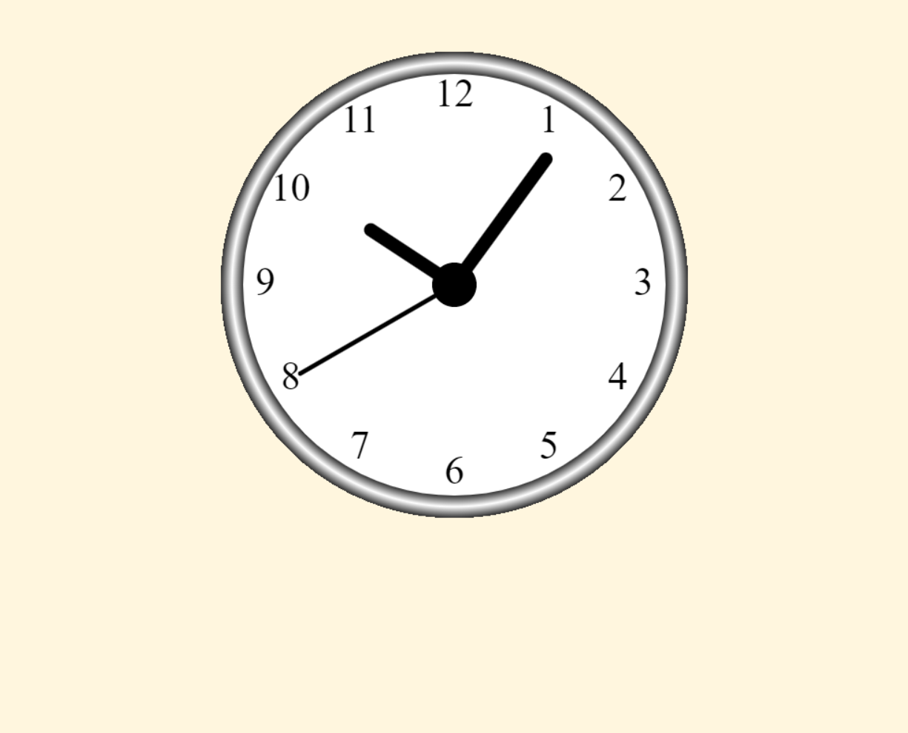

# AnalogueClock
Repository for an analogue clock made with JavaScript!

The project is part of the "Front End Developer - HTML CSS Bootstrap JavaScript React" course avilable in Udemy!

[Link para acessar](https://geraldopmj.github.io/AnalogueClock/)

# Technology used:

- JavaScript
- Git e Github

## Contact:

geraldo.pmj@gmail.com

## Preview:

